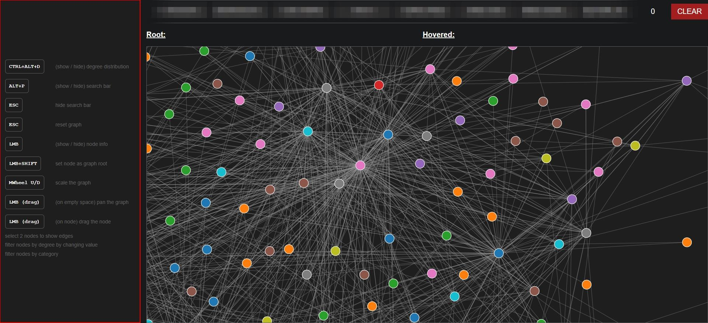
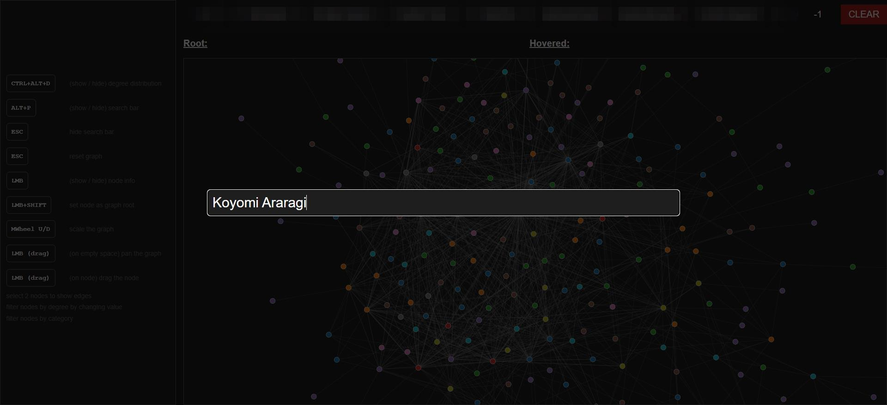
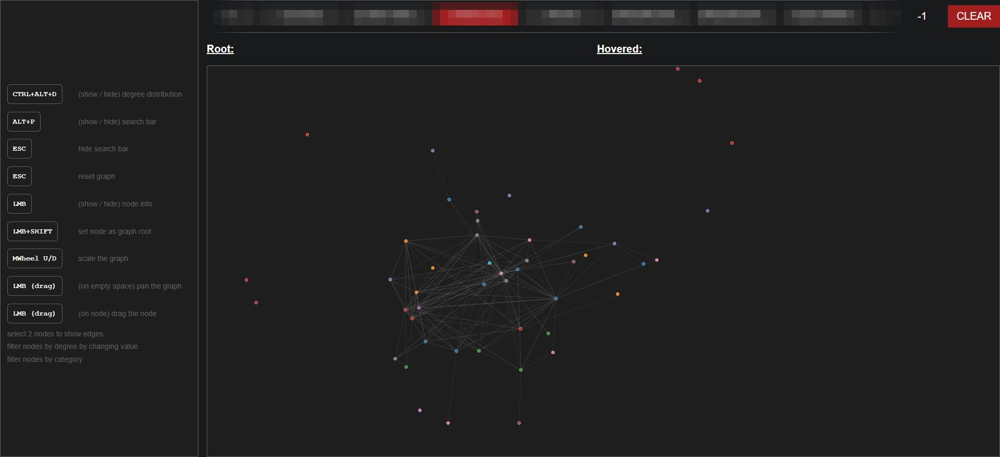
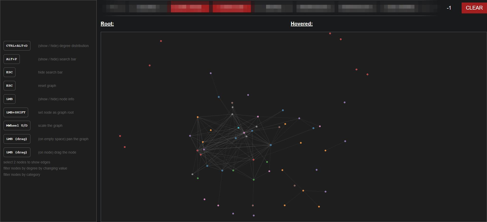
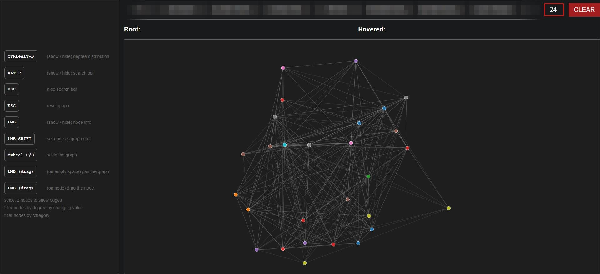
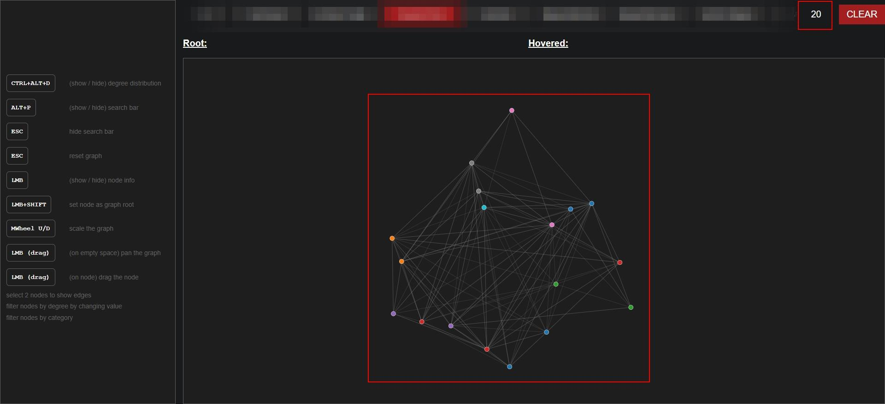
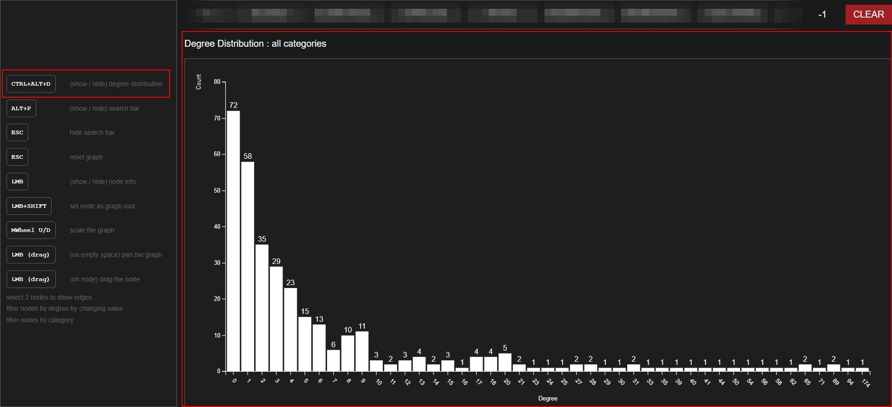

# Graph Visualizer

This is a simple tool to visualize the graph created from a dataset.

## Requirements

[Node.js](https://nodejs.org/) and [npm](https://www.npmjs.com/) are required to run this project.

## Installation

1. Clone this repository.
2. Run `npm install` to install the dependencies.
3. Run `npm run dev` to start the development server.
4. Open `http://localhost:5173` in your browser.

## Usage

A list of commands is available in the sidebar. You can use these commands to navigate the graph.

Click on a node to select it. The selected node will be highlighted and displayed in the sidebar. Selecting 2 nodes will display the information about the links between them (if any). Selecting more than 2 nodes will display only the information about the selected nodes.

It's possible to search for a node by typing its name (exact match). The node will be set as the root of the graph.

If a root is selected, the graph will show only the nodes that are reachable from the root.

It's possible to filter the nodes by category. The graph will show only the nodes that belong to the selected category. It's also possible to filter multiple categories.

The graph will show only the nodes that belong to one of the selected categories.

It's possible to show only the nodes that have at least a certain degree (greater or equal).

It's possible to combine category and degree filter at the same time.

By using the distribution command, it's possible to see the distribution of the nodes. Using the command again will hide the distribution and show the graph.

It's possible to see the distribution of the nodes by category. Only the nodes that belong to the selected category will be considered. It's not possible to combine this command with the degree filter or select more than one category.

## API

When running locally, the API is available at `http://localhost:5173/api`  
The following endpoints are available:

- **`/store`**
  - **GET**: ---
  - **POST**: Stores data in the database
  - **PUT**: ---
- **`/data`**
  - Allows you to select a node via a UI for further commands.
  - Redirects to `/data/[src]` on submit
- **`/data/all`**
  - Returns a list of all nodes
- **`/data/[src]`**
  - Allows you to select another node via a UI
  - Redirects to `/data/[src]/[dst]` on submit
- **`/data/[src]/positive`**
  - Returns available examples for the selected node
- **`/data/[src]/negative`**
  - Returns negative examples for the selected node randomly extracted from the graph based on node distance (configurable in `$lib/stores.js@is_connected`)
- **`/data/[src]/[dst]`**
  - Returns the information about the link between the nodes
